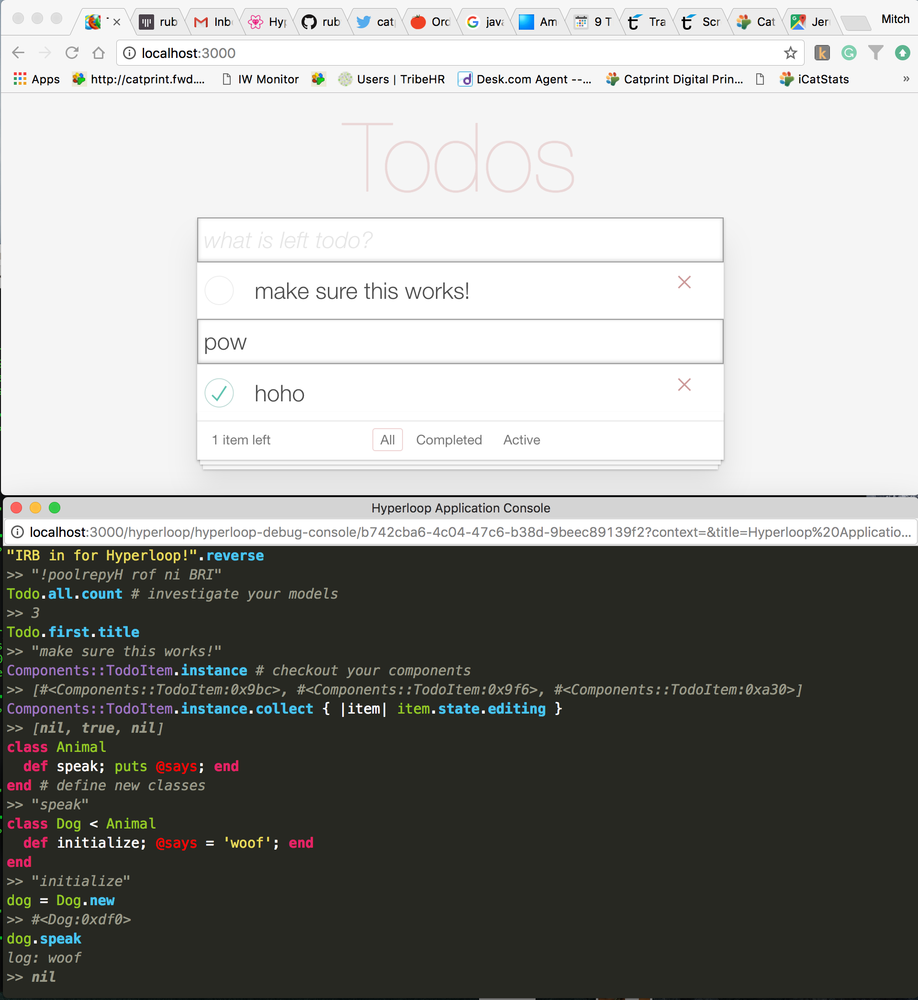

# Hyper-Console

IRB style console for [Hyperloop](http://ruby-hyperloop.io) applications.



### Installation

Add

```ruby
gem 'hyper-console'
```

To the development and test sections of your Gemfile.

Do a `bundle install`, and `rm -rf tmp/cache`, then restart the server, hit one of your web pages, and the console will open.

*Note currently you must have enabled the `Hyperloop::Application` channel in your policies.  Hopefully we can remove this in the future*

### Details

The `hyper-console` gem adds the `console` method to `Kernel`.  If you call `console` from anywhere in your client code, it will open a new *popup* window, that is running an IRB style read-eval loop.  The console window will compile what ever ruby code you type, and if it compiles, will send it to your main window for execution.  The result (or error message) plus any console output will be displayed in the console window.

+ You may use the up/down arrow keys to move to previous expressions, edit them, and resend.  
+ If you are editing a block of code you can send the block immediately without moving to the end of the expression by using command (or ctrl) enter.
+ The console history is stored in the popups html local store, so it will be retained across window reloads.
+ The expression can be arbitrarily complex.  You can investigate model scopes, and attributes, run Operations, and get the current value of component states.
+ You can even create classes, or open existing classes and modify their behavior.

### The `instance` method

The console gem adds an `instance` method to all classes.  This will return an array like object of all the current instances of that class, *except instances bound to closures (sorry!)*.  

For example if you have a component named `Components::TodoItem` then

```ruby
Components::TodoItem.instance[0] # first instance
Components::TodoItem.instance    # array of all the instances
Components::TodoItem.instance[0].dom_node  # returns the mount point
```

This is all very handy for investigating the state of Components and Stores.  For example assuming your top level component is named `App` and is using hyper-router, you can do things like this:

```ruby
App.instance[0].location.pathname # current path
App.instance[0].history.push '/topics' # change path to `/topics`
```

Because its common for there to be a single instance of some classes, the expression `instance[0]` can be shortened to just `instance` when there is only one instance of a class.  For example in the above example you could just say `App.instance.location.pathname`.

### Console Context

Each console window (you can have several) has an execution context, which is simply an expression that is used to determine the value of `self` that console executes in.  

For example let's say you have a `Todo` model.  You could in the console window evaluate

```ruby
console context: 'Todo.first'
```

And a new console window will be opened that is "bound" to `Todo.first` so that in this window you can simply evaluate

```ruby
title
```
Instead of `Todo.first.title`

Combining this with the `instance` method gives you a way to create a console window on a specific object in your application:

```ruby
console context: 'App.instance'
```

Will create a console window whose `self` is your top level application component.

*Note: if no context is provided, the context will be main opal context.*

### Console Titles

You can also give console windows a title:

```ruby
console text: 'App.instance', title: 'App'
```

### Loading / Reloading from Javascript

The `hyperconsole` method is added to the javascript window object, so in your application's javascript console you can say `hyperconsole()` to load (or reload) the main hyperconsole window.  When reloading any prior command history will be retained, so this makes a nice escape hatch if things ever become totally confused.

### Loading at Application Boot

By default a console will be created when your page loads.  You can turn this off by setting
```ruby
config.console_auto_start = false
```
in your hyperloop rails initializer.

You can still start the console using `hyperconsole()` as described above.

### How it works

The console and main application window communicate via two Hyperloop Operations: `Evaluate`, and `Response`.  

As you type, the console runs the Opal compiler in the console window, and when you have a valid ruby expression, the resulting compiled code is sent to the main window using `Evaluate`.  The main window receives the Evaluate dispatch, does a javascript eval and returns the result.  

## Development

After checking out the repo, run bundle install.

The console assets are packaged into a single JS file, and a single style sheet.  Running `rake` will build the packages, and put them in the appropriate directories.

## TODO (help wanted)

+ configurable themes, especially smaller font size
+ full keyboard controls (i.e things like ctrl-a moves to beginning of line)
+ remove dependency on `Hyperloop::Application` channel
+ Peer to peer communication once initial connection is made
+ Chrome extension so that console can be attached physically to main window
+ add some kind of test suite, and ability to test without building the asset package

## Contributing

Bug reports and pull requests are welcome on GitHub at https://github.com/[USERNAME]/hyper-console. This project is intended to be a safe, welcoming space for collaboration, and contributors are expected to adhere to the [Contributor Covenant](http://contributor-covenant.org) code of conduct.

## License

Hyperloop gems are released under the [MIT License](http://www.opensource.org/licenses/MIT).
